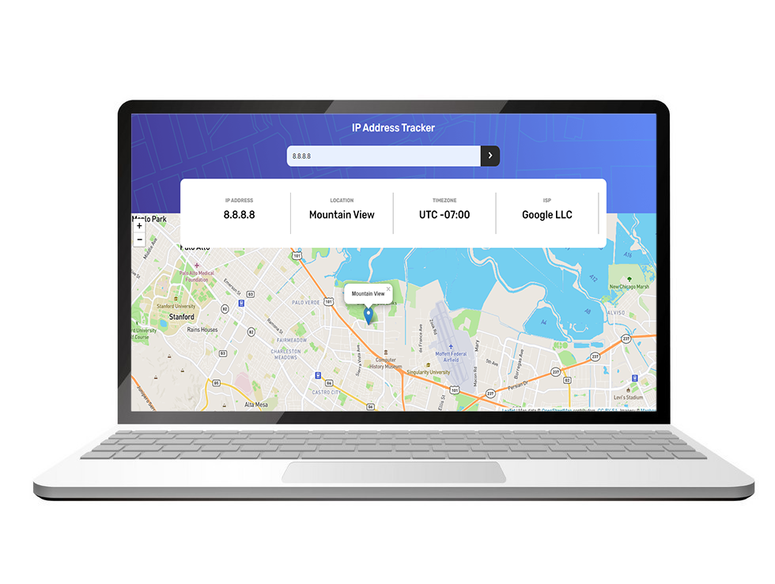
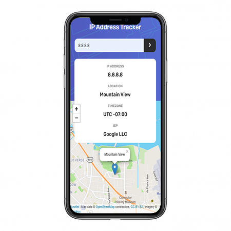

<h1 align="center">Frontend Mentor - IP Address Tracker</h1>

<p align="center">


</p>

## Welcome! 👋

Thanks for checking out this front-end coding challenge.

[Frontend Mentor](https://www.frontendmentor.io) challenges allow you to improve your skills in a real-life workflow.

## The challenge 🥇

Your challenge is to build out this IP Address Tracker app and get it looking as close to the design as possible. To get the IP Address locations, you'll be using the [IP Geolocation API by IPify](https://geo.ipify.org/). To generate the map, we recommend using [LeafletJS](https://leafletjs.com/).

You can use any tools you like to help you complete the challenge. So if you've got something you'd like to practice, feel free to give it a go.

Your users should be able to:

- View the optimal layout for each page depending on their device's screen size
- See hover states for all interactive elements on the page
- See their own IP Address on the map on the initial page load
- Search for any IP addresses or domains and see the key information and location

---

⚠️ **IMPORTANT** ⚠️: To use the IP Geolocation API by IPify, you'll need to sign up for a free account. You won't need to add any cards details to do this and it's a very quick process. This will generate an API Key for you. Usually, you would be able to restrict your API Key to a specific URL (your own domain). This makes sure that other people can't use your API Key on their own websites. IPify doesn't have this feature, but because you aren't adding your card details, this isn't an issue. **So be sure to only sign up for the free account and DO NOT enter any card details**.

For the mapping API, we recommend using [LeafletJS](https://leafletjs.com/). It's free to use and doesn't require an API Key. If you decide to use another API, like Google Maps or Mapbox, be sure to secure your API Key. Here are guides for both Google Maps and Mapbox, be sure to read through them thoroughly:

- [API Key best practices from Google Developers](https://developers.google.com/maps/api-key-best-practices)
- [How to use Mapbox securely](https://docs.mapbox.com/help/troubleshooting/how-to-use-mapbox-securely/)

Exposing your API Key publicly can lead to other people using it to make requests for their own application if the proper precautions aren't in place. Please be sure you read the guides thoroughly and follow their recommendations.

**We don't take any responsibility if you expose your API Key while completing the challenge and have not secured it.**

---

Want some support on the challenge? [Join our Slack community](https://www.frontendmentor.io/slack) and ask questions in the **#help** channel.

## Techs 💻

- [HTML5](https://developer.mozilla.org/en-US/docs/Web/HTML/HTML5)
- [CSS3](https://developer.mozilla.org/en-US/docs/Web/CSS)
- [Javascript](https://developer.mozilla.org/en-US/docs/Web/JavaScript)
- [LeafletJS](https://leafletjs.com/)
- [Ipify Api](https://geo.ipify.org/docs)
- [Mapbox](https://docs.mapbox.com/)

## Where to find everything 🔍

Your task is to build out the project to the designs inside the `/design` folder. You will find both a mobile and a desktop version of the design to work to. 

The designs are in JPG static format. This will mean that you'll need to use your best judgment for styles such as `font-size`, `padding` and `margin`. This should help train your eye to perceive differences in spacings and sizes.

You will find all the required assets in the `/images` folder. The assets are already optimized.

There is also a `style-guide.md` file, which contains the information you'll need, such as color palette and fonts.

Access [This URL](https://www.cloudflare.com/ips/) to get some ips you can use to test.

## Running project 🛠️

to run this project on your environment follow these steps:

1. Clone this repository to your local machine running this command 👇

```
git clone https://github.com/washington299/Ip-address-tracker
```

2. Then go to project's folder running this command 👇

Windows:
```
cd .\Ip-address-tracker\
```
Linux:
```
cd ./Ip-address-tracker.git
```

3. Now you can open the project on your editor and drag the **index.html** file to the browser 😄.

---

Made with ❤️ by [Washington Campos](https://github.com/washington299).
